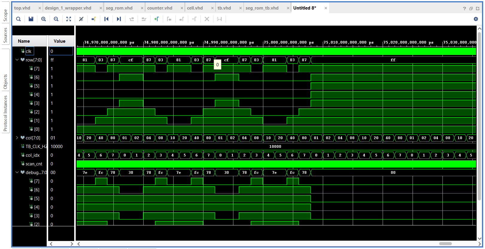

# FPGA Matrix Display Counter

FSM-controlled VHDL counter for an 8x8 LED matrix display on FPGA/Zynq, developed in Vivado with BCD counters, ROM digit decoding, multiplexing, simulations and custom animations.

## Overview

This project implements a graphical two-digit decimal counter for an 8x8 LED matrix display using VHDL.  
The whole behavior is controlled by an internal finite state machine and runs directly in FPGA logic without user input.

The design was created as a university FPGA/VHDL project and verified using behavioral simulations in Vivado.

## Features

- Two-digit decimal counter displayed on an 8x8 LED matrix
- Slow counting sequence from `00` to `10`
- Fast counting sequence from `10` to `99`
- Inverse countdown sequence `90, 80, ..., 00`
- ROM-based conversion from BCD digits to seven-segment representation
- Conversion of digit segments into an 8x8 display bitmap
- 64 generated display cells using `for-generate`
- Column multiplexing for LED matrix control
- Static image display
- Image rotation
- Custom animation sequence:
  - display filling
  - blinking
  - spiral fade-out
- VHDL testbenches for selected components
- Documentation with simulation waveforms and architecture diagrams

## Architecture

The design consists of several main parts:

- **Clocking Wizard**  
  Generates a 25 MHz clock signal for the FPGA logic.

- **FSM controller**  
  Controls the main application sequence:
  counting, inverse countdown, image display, rotation and animations.

- **BCD counters**  
  Two BCD counters are used for ones and tens digits.

- **ROM digit decoder**  
  Converts BCD values into seven-segment codes.

- **Bitmap generator**  
  Converts seven-segment digit data into a 64-bit 8x8 matrix bitmap.

- **Display cells**  
  The matrix output is processed through 64 generated `cell` instances.  
  Each cell selects between BCD digit data, image data or animation data and can optionally invert the output.

- **Display multiplexer**  
  Drives the LED matrix column by column. Columns are active high and rows are active low.

## System Sequence

The implemented sequence is:

1. Count from `00` to `10` with a 1 second step.
2. Count from `10` to `99` with a 100 ms step.
3. Display inverse countdown `90, 80, ..., 00` with a 500 ms step.
4. Display a static image for 5 seconds.
5. Rotate the image twice to the left.
6. Run a custom animation.
7. Return to the beginning and repeat the sequence.

## Repository Structure

```text
.
├── src/
│   ├── top.vhd
│   ├── cell.vhd
│   ├── counter.vhd
│   ├── seg_rom.vhd
│   └── matrix_pack.vhd
├── sim/
│   ├── counter_tb.vhd
│   ├── matrix_pack_tb.vhd
│   ├── seg_rom_tb.vhd
│   └── tb.vhd
├── constr/
│   └── zynq.xdc
├── docs/
│   ├── documentation.pdf
│   ├── documentation.tex
│   └── img/
├── README.md
└── LICENSE

## Example Simulation


